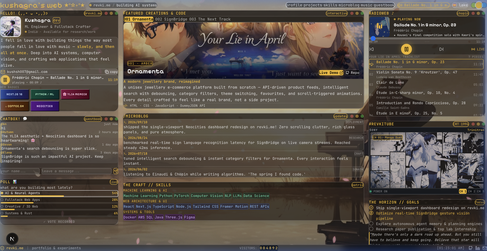

<div align="center">

# kushagra's web ★ revki.me

<samp>A single-viewport memoir & dashboard inspired by <i>Your Lie in April</i> and 90s Neocities web culture.</samp>

<br><br>

[](https://revki.me)
&nbsp;
[](https://github.com/nottkushagra)
&nbsp;
[](https://linkedin.com/in/nott-kushagra/)
&nbsp;
[](mailto:kushsh007@gmail.com)

<br><br>



<br><br>

> *"I met the girl under the bloomed cherry blossoms, and my faded, monochrome world began to change."*  
> <sub>— Your Lie in April (四月は君の嘘)</sub>

</div>

<br>

---

## 🌸 Overview

**[revki.me](https://revki.me)** is a personal web space designed as a non-scrolling, single-viewport desktop dashboard. Drawing inspiration from personal retro web craft like [isobelsweb.com](https://isobelsweb.com/) and the visual poetry of *Your Lie in April*, it replaces traditional corporate resumes with an expressive digital room complete with functional classical piano audio, a retro Sony Trinitron CRT TV, project archives, and interactive Neocities elements.

<br>

## ✨ Highlights & Features

### 1. 🎵 `radioweb ♪` — Classical Audio Player
A custom HTML5 audio player containing the authentic classical pieces performed throughout *Your Lie in April*:
- **Frédéric Chopin**: *Ballade No. 1 in G minor, Op. 23* (11:19) — Kousei's finale solo with Kaori's spirit.
- **Ludwig van Beethoven**: *Violin Sonata No. 9 "Kreutzer", Op. 47* (10:23) — Kaori & Kousei's competition duet.
- **Claude Debussy**: *Suite bergamasque: Clair de Lune* (05:04) — Ethereal reflective moonlight.
- **Frédéric Chopin**: *Étude in C-sharp minor, Op. 10, No. 4 ("Torrent")* (02:08) — Frantic competition preliminary.
- **Camille Saint-Saëns**: *Introduction and Rondo Capriccioso, Op. 28* (09:22) — Kaori's free violin audition.
- **Frédéric Chopin**: *Étude in E minor, Op. 25, No. 5 ("Wrong Note")* (03:39) — The gentle breeze for Kaori.
- **J.S. Bach**: *Well-Tempered Clavier, Prelude No. 3 in C-sharp major, BWV 848* (01:21) — Mechanical discipline.

*Features real seekable timeline scrubbing, real-time duration calculation, auto-advancing playlists, animated audio bars, and full synchronization with the top navigation bar and bio mini-player.*

### 2. 📺 `#revkitube` — Sony Trinitron CRT TV
An authentic 1994 CRT monitor frame with scanlines, radial screen glare, power LED indicators, and multi-channel art switching showcasing anime collages and ethereal duets.

### 3. 🎨 Adaptive Themes & Wallpapers
- **Theme Accents**: Switch on-the-fly between **Spring Lime** (`#a3e635`), **Warm Amber** (`#fbbf24`), and **Cyber Cyan** (`#38bdf8`).
- **Atmospheric Backgrounds**: Seamlessly cycle between `🌅 lake`, `🎹 sunlit`, `☁️ sky`, and `🌲 forest`.
- **Gentle Sakura Petals**: Floating CSS cherry blossom petals with subtle wind drift and depth rotation.

### 4. 💬 Guestbook & Community Poll
- **Interactive Guestbook**: Visitors can sign their name and leave messages saved locally in browser storage.
- **Live Poll**: Interactive voting widget tracking community favorite anime aesthetics.
- **Classic Neocities Hit Counter & 88×31 Web Badges**: A tribute to the personal web era.

### 5. 💼 Project Showcase
- **[SignBridge](https://github.com/nottkushagra/SignBridge)**: Real-time sign language recognition platform bridging deaf and hearing communities through computer vision and speech APIs.
- **[Ornamenta](https://nottkushagra.github.io/Ornamenta/)**: Modern unisex jewelry brand with debounced search, filtering, and fluid micro-interactions.
- **The Next Track**: Autonomous agent memory and neuro-symbolic planning engines.

<br>

---

## 🛠️ Tech Stack

- **Framework**: [Next.js 16](https://nextjs.org/) (Turbopack, App Router)
- **Language**: [TypeScript](https://www.typescriptlang.org/)
- **UI & Layout**: React 19 + Vanilla CSS + Tailwind 4 custom tokens
- **Audio Engine**: Custom HTML5 Web Audio context with real-time seeking and playlist event handling
- **Icons**: [Lucide React](https://lucide.dev/) + Custom retro pixel SVGs
- **Typography**: `Pixelify Sans`, `JetBrains Mono`, `Inter`

<br>

---

## 🚀 Running Locally

Clone the repository and install dependencies:

```bash
# Clone the repo
git clone https://github.com/nottkushagra/YourLieInPortfolio.git

# Navigate into directory
cd YourLieInPortfolio

# Install dependencies
npm install

# Start the dev server
npm run dev
```

Open [http://localhost:3000](http://localhost:3000) in your browser.

To verify the production build:

```bash
npm run build
npm run start
```

<br>

---

## 📬 Connect

- **Portfolio**: [revki.me](https://revki.me)
- **GitHub**: [@nottkushagra](https://github.com/nottkushagra)
- **LinkedIn**: [kushagra](https://linkedin.com/in/nott-kushagra/)
- **Email**: [kushsh007@gmail.com](mailto:kushsh007@gmail.com)

<br>

<div align="center">
<sub>Crafted with care · Reaching you through the music of code · Inspired by spring</sub>
</div>
