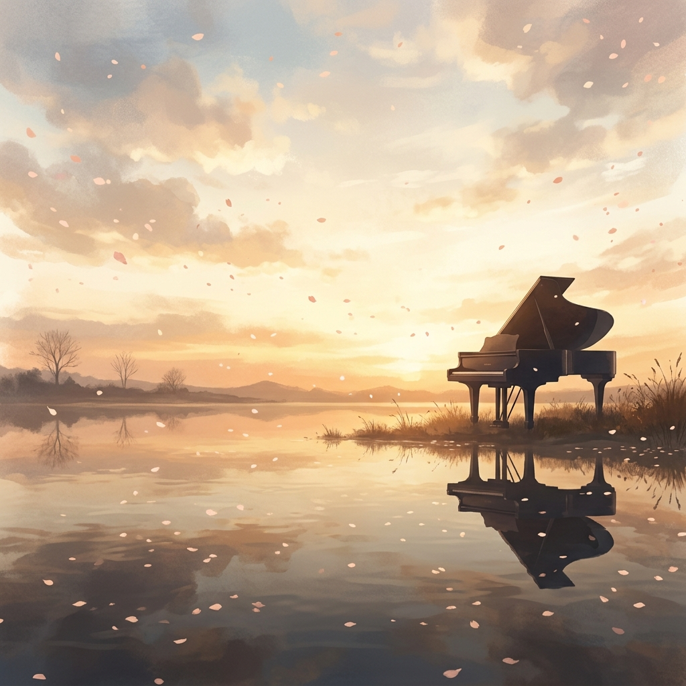
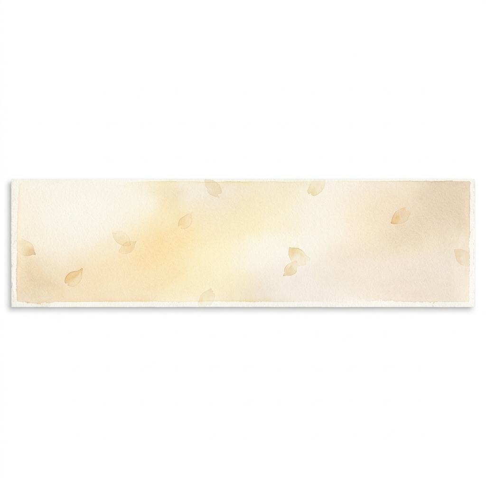

<!-- 
  ╔══════════════════════════════════════════════════╗
  ║  Your Lie in Portfolio — Kushagra                ║
  ║  An editorial portfolio, inspired by spring.     ║
  ╚══════════════════════════════════════════════════╝
-->

  

# Kushagra

<samp>B.Tech · AI · Full-Stack · Builder</samp>

 

*"I met the girl under the bloomed cherry blossoms,*
*and my faded, monochrome world began to change."*

— Your Lie in April

  

&nbsp;&nbsp;

&nbsp;&nbsp;

 

 

## About

I'm a first-year B.Tech student who fell in love with building things —
systems that think, interfaces that feel, and tools that disappear into the hands of the people using them.

Right now, I'm deep into **machine learning**, **full-stack development**, and the quiet intersection where AI meets human creativity. I believe the best technology is the kind you don't notice — it just works, and it makes life a little better.

When I'm not writing code, I'm reading about distributed systems, listening to Einaudi, or thinking about what to build next.

 

---

 

## The Soundtrack

Skills composed across disciplines

 

<table>
<tr>
<td width="50%" valign="top">

**AI & Machine Learning**

Machine Learning · LLMs · Data Science · PyTorch · NLP

</td>
<td width="50%" valign="top">

**Full Stack**

React · Next.js · Node.js · TypeScript · REST APIs

</td>
</tr>
<tr>
<td width="50%" valign="top">

**Backend**

Python · Java · SQL · Docker · AWS

</td>
<td width="50%" valign="top">

**Frontend**

Tailwind CSS · Framer Motion · Three.js · Figma

</td>
</tr>
</table>

 

---

 

## Albums

A discography of things I've built

 

### Ornamenta

*A modern jewellery brand, reimagined*

A masculine/unisex jewellery e-commerce platform with API-fetched products, search with debouncing, category filters, dark/light mode, favourites, and scroll-triggered animations. Built to look and feel like a real brand.

`HTML` · `CSS` · `JavaScript` · `DummyJSON API`

[**→ Source**](https://github.com/nottkushagra/Ornamenta) &nbsp;&nbsp; [**→ Live**](https://nottkushagra.github.io/Ornamenta/)

 

### SignBridge

*Breaking communication barriers with AI*

An AI-powered inclusive communication platform that bridges the gap between deaf/mute individuals and the hearing community through real-time sign language recognition, speech-to-text, and text-to-voice.

`Python` · `Computer Vision` · `TensorFlow` · `Speech APIs`

[**→ Source**](https://github.com/nottkushagra/SignBridge)

 

### The Next Track

*Something new is in the works. Stay tuned.*

`???`

 

---

 

  

every project is a new movement in a longer composition

 

---

 

## The Spring I Found Code

A brief timeline

 

| | |
|---|---|
| **2025** | Started B.Tech — the first chapter. Walking into a new world of possibilities, with a laptop and a dream. |
| **2025** | Discovered AI — when I first trained a model and watched it learn, it felt like composing music from noise. |
| **2026** | Built Ornamenta — a jewellery brand brought to life online, bold design, real API data, every detail crafted with intention. |
| **2026** | Started SignBridge — because communication shouldn't have barriers. |

 

---

 

## Looking Ahead

Stars I'm reaching for

 

**Near-term**
- Ship SignBridge v1
- Learn Rust
- Open Source Contribution

**Aspirations**
- Build an AI Product
- Intern at a Top Lab
- Publish a Research Paper

**Dreams**
- Start a Company
- Teach & Mentor
- Build Something Unforgettable

 

---

 

## Letters to the Future

Thoughts close to my heart

 

<strong>On Learning</strong>

 

Every day I discover that the more I learn, the less I know. Right now I'm deep into transformer architectures and the mathematics behind attention. It's beautiful how a concept from cognitive science became the backbone of modern AI.

<strong>Books on My Desk</strong>

 

Currently reading *Designing Data-Intensive Applications* — it's changing how I think about systems. Also re-reading *The Pragmatic Programmer* because some wisdom needs revisiting.

<strong>The Playlist</strong>

 

Lately it's been a lot of Ludovico Einaudi while coding. There's something about minimalist piano that makes complex problems feel approachable. Also: lo-fi beats for the late-night debugging sessions.

<strong>Where I'm Headed</strong>

 

I want to build tools that feel invisible — technology that fades into the background and lets humans do what they do best. The intersection of AI and human creativity is where I want to live.

 

---

 

  

*"Maybe there's only a dark road up ahead.*
*But you still have to believe and keep going.*
*Believe that the stars will light your path,*
*even a little bit."*

— Kaori Miyazono

  

—

  

Reaching you through the music of code

 

&nbsp;&nbsp;

&nbsp;&nbsp;

&nbsp;&nbsp;

 

built with care · inspired by spring · <a href="src/_archive/bubblegum-heaven/">v1 archive</a>

